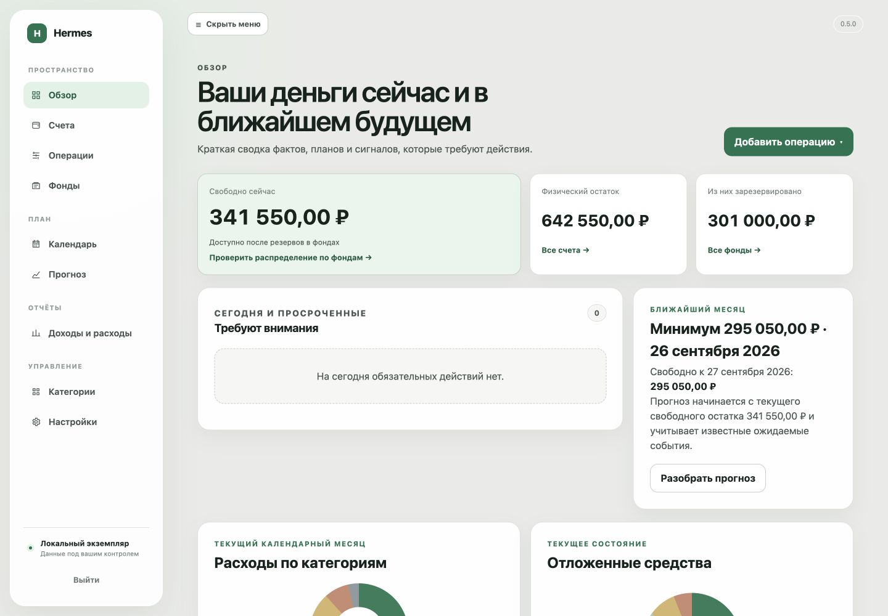
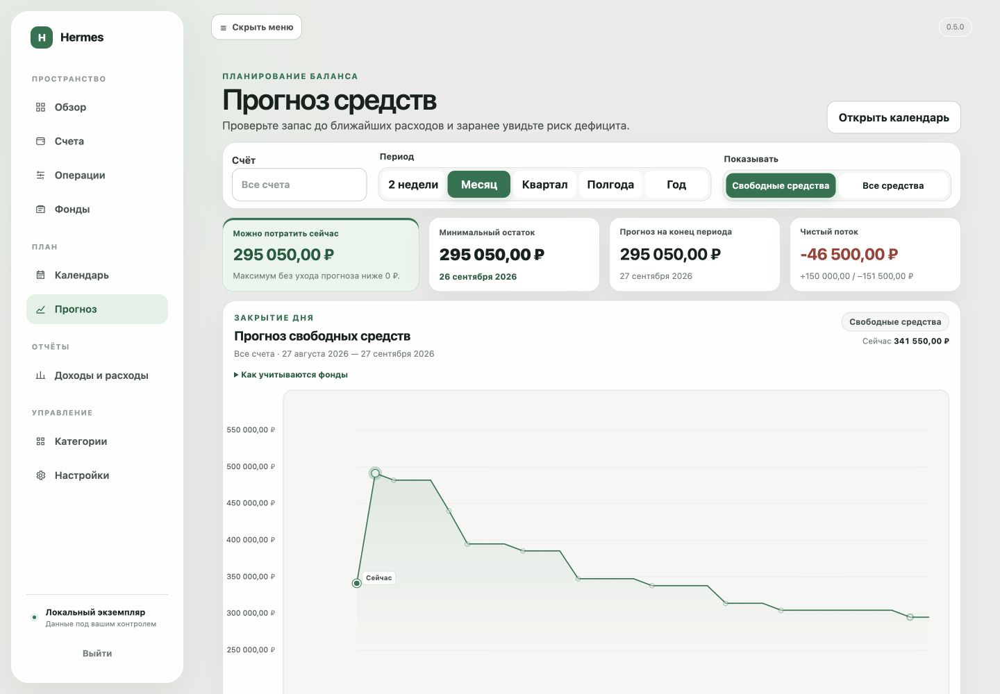
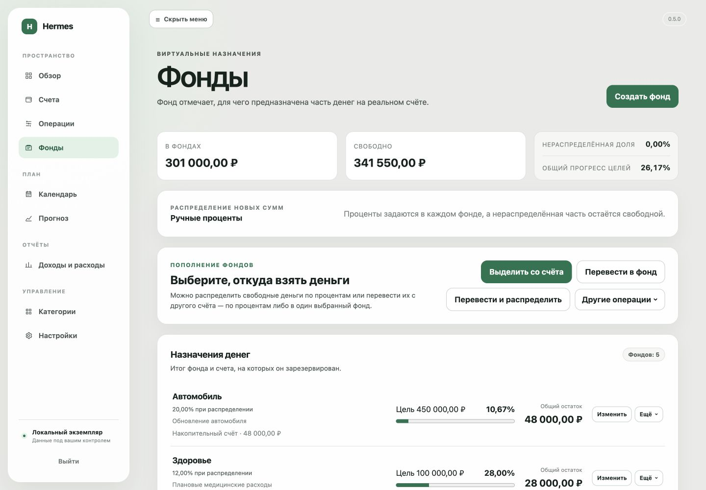
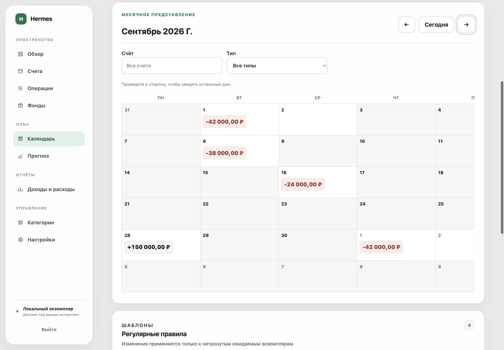
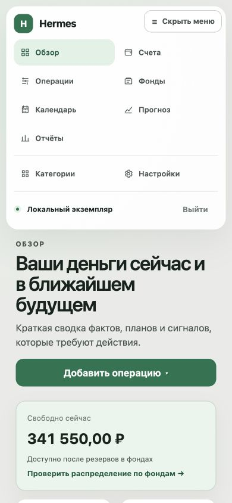
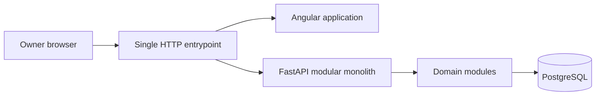

<div align="center">

# Hermes

**A self-hosted personal finance command center for exact accounting, purposeful
savings, planned operations, and explainable cash forecasting.**

[](docs/project-status.md)
[](docs/operations/deployment.md)
[](LICENSE)

</div>



All screenshots use a synthetic demonstration dataset; no personal financial
data is included.

Hermes helps one owner understand not only where money went, but what is free to
use, what has already been assigned to goals, and how known plans may change the
future balance. It runs on your own computer or home server, stores data in your
PostgreSQL database, and does not depend on an external cloud service.

> [!IMPORTANT]
> Hermes is an internal pre-1.0 application. Version `0.5.0` is implemented, but
> owner acceptance on restored real data and the first public-release decision
> remain open. The current deployment boundary is loopback or a trusted network;
> direct public-internet exposure is unsupported.

## Why Hermes

- **Free money first.** Physical balance, virtual funds, account reserves, and
  genuinely free money remain distinct instead of collapsing into one total.
- **The future is explainable.** Forecast points are derived from current
  balances and known planned events, with the exact events behind each change.
- **Financial operations stay exact.** Money uses `Decimal`/`NUMERIC`, writes are
  transactional, and displayed values follow one deterministic formatting and
  rounding contract.
- **Your data stays yours.** Hermes is single-owner and self-hosted, with
  protected `.hermes` backups and an explicit plaintext JSON option.

## Product tour

### Understand the next month

Forecast free or total money across five horizons, inspect the minimum balance,
cash-gap risk, net flow, and every event that changes the projection.



### Give saved money a purpose

Virtual funds reserve parts of real account balances for goals without creating
separate bank accounts. Hermes tracks progress, physical coverage, free money,
and manual or dynamic allocation.



### Plan without changing today's balance

Recurring rules and one-off plans stay balance-neutral until they are confirmed.
The calendar shows exact dated amounts and keeps overdue actions explicit.



<details>
<summary><strong>Responsive interface</strong></summary>

Hermes adapts its navigation and content hierarchy for narrow screens rather
than shrinking the desktop layout mechanically.

<p align="center">
  
</p>

</details>

The current runtime interface is in Russian. A multilingual foundation and an
English interface are planned after the stable self-hosted core.

## Current capabilities

### Everyday finance

- cash, debit, and savings accounts with ledger-derived balances;
- income, expense, transfer, and balance-adjustment operations;
- required income/expense categories, nested category trees, and archive-safe
  historical references;
- journal filtering, details, pagination, category reports, and monthly or
  custom reporting periods;
- exact addition and subtraction directly in monetary inputs.

### Funds and available money

- virtual funds backed by money on physical accounts;
- per-account physical, fund-reserved, reserve, and free coverage;
- manual percentages or dynamic allocation based on relative unfilled progress;
- atomic allocation, redistribution, fund-to-fund movement, and fund-aware
  account transfers;
- target caps, automatic reserve refill, and deterministic rounding.

### Planning and forecasting

- recurring income, expense, and transfer rules;
- one-off future plans that remain balance-neutral until applied;
- monthly calendar, upcoming and overdue states, confirmation, postponement,
  cancellation, and optional recurring-series shifting;
- per-account and combined forecasts across two weeks, one month, one quarter,
  six months, or one year;
- free-money and total-balance modes, risk warnings, and exact event explanations.

### Access and data protection

- atomic first-run setup or restore, master password, base currency, and IANA
  timezone;
- Argon2id password storage, revocable server-side sessions, CSRF protection,
  login throttling, and idle-session expiry;
- authenticated `.hermes` backup envelopes plus explicit plaintext JSON export;
- previewed, validated, transactional restore.

See the [current project status](docs/project-status.md) for the factual
verification snapshot, known limitations, and the next release gate.

## Run locally

The shortest production-like path requires Docker 29+ with Docker Compose v2
and `make`.

```bash
cp .env.example .env
# Replace POSTGRES_PASSWORD in .env.
# For loopback-only plain HTTP, set HERMES_COOKIE_SECURE=false.
make up
```

Open `http://localhost:8000`. Angular and the API share one HTTP entrypoint, and
PostgreSQL remains inside the Compose network. Stop the application with
`make down`.

> [!WARNING]
> Do not expose an uninitialized Hermes instance or PostgreSQL directly to the
> internet. Remote access requires a protected network, VPN, or a maintained
> HTTPS reverse proxy with secure cookies enabled. Read the
> [security policy](SECURITY.md) before using real financial data.

## Development

Requirements: Python 3.13, Node.js 22.22.3 or newer within the supported Node 22
line, npm, Docker Compose, and `make`.

```bash
cp .env.example .env
make setup
make dev
```

Open `http://localhost:4200`. The Angular development server proxies `/api` to
FastAPI on `http://localhost:8000`.

Run the complete local quality gates with:

```bash
make test
make lint
make typecheck
```

The [local development guide](docs/operations/local-development.md) documents
individual commands, dependency changes, migrations, and disposable PostgreSQL
integration tests.

## Architecture

Hermes is a modular monolith: one deployable application, one PostgreSQL
database, and explicit public boundaries between financial domains.



- Python 3.13, FastAPI, SQLAlchemy 2, Alembic, Pydantic, and PostgreSQL;
- Angular 22 with standalone components and strict TypeScript;
- pytest, Ruff, mypy, ESLint, Prettier, and Vitest;
- Docker and Docker Compose;
- no microservices, broker, background worker, Redis, Kubernetes, or external
  cloud data dependency.

Read the [architecture overview](docs/architecture/overview.md),
[module boundaries](docs/architecture/module-boundaries.md), and
[data flows](docs/architecture/data-flow.md) before changing cross-domain
behavior.

## Status and roadmap

Hermes is a personal project whose direction follows the maintainer's own use.
The current `0.x` line is internal testing; `1.0.0` requires a separate owner
decision after real-data acceptance and release hardening.

The long-term north star is **Oracle · What if?**: deterministic temporary
scenarios that compare a financial decision with the baseline forecast without
changing the ledger or confirmed plan. Oracle is planned and is not part of the
current release.

- [Current project status](docs/project-status.md)
- [Development roadmap](docs/roadmap.md)
- [Changelog](CHANGELOG.md)

## Documentation and support

- [Documentation map](docs/index.md)
- [UI/UX contract](DESIGN.md)
- [Deployment runbook](docs/operations/deployment.md)
- [Backup and restore](docs/operations/backup-and-restore.md)
- [Security policy](SECURITY.md)

For defects and focused proposals, use the
[GitHub issue tracker](https://github.com/Gollardo/hermes/issues). Do not include
credentials, backup contents, or personal financial data in an issue.

## Contributing

Issues and pull requests are welcome when they align with the project's
direction, but there is no guaranteed response or review schedule. Keep changes
small, preserve module boundaries and financial invariants, and include checks
appropriate to the risk.

Read [CONTRIBUTING.md](CONTRIBUTING.md) before starting implementation.

## License

Copyright holders license Hermes under the
[GNU Affero General Public License v3.0 or later](LICENSE), SPDX identifier
`AGPL-3.0-or-later`.
