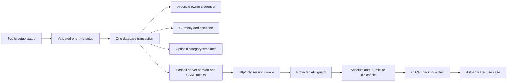
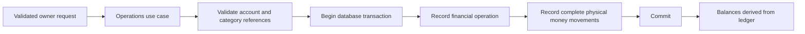
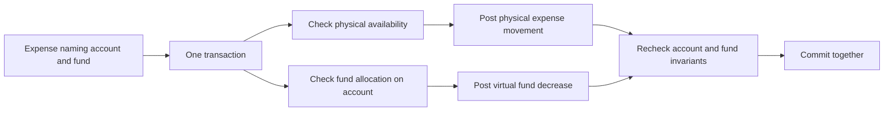
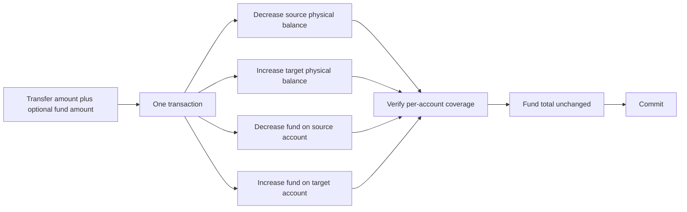
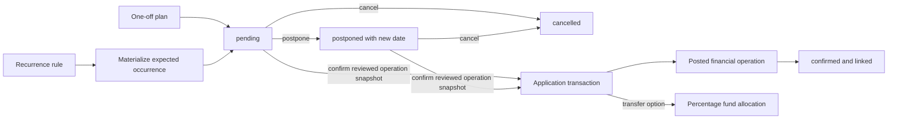
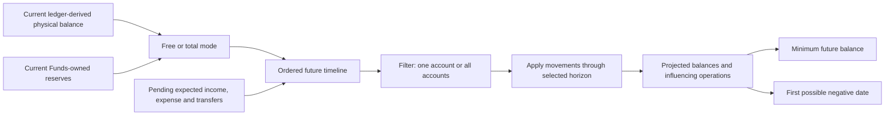
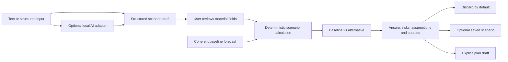

# Data flows

The diagrams describe confirmed semantic flows. Names such as “transaction
boundary” are architectural concepts, not promised endpoint, class or table
names.

## First-run setup and authenticated requests

First-run backup restore is an alternative branch of the same setup
transaction: identify legacy JSON or Hermes V1, authenticate/decrypt an
encrypted payload before writes, validate integrity and domain invariants,
create the new destination credential/session, replace settings and financial data, run
post-write checks, then commit. Any validation or insertion failure rolls back
the credential as well as restored data.

After credential commit, setup can only report a conflict. Login throttling is
locked and updated in the same database transaction as password verification
and session issuance, preventing parallel attempts from bypassing the counter.
Database request dependencies close at FastAPI function scope, so a successful
HTTP response and authentication cookies are sent only after transaction commit.
The Angular shell also tracks keyboard, pointer, touch and scroll activity. It
ends the visible session at 30 minutes and sends a throttled authenticated
heartbeat while the owner remains active, so a long form edit does not expire
merely because it has not yet produced a business request. Activity is shared
between tabs of the same origin; the backend remains authoritative.

## Posting an ordinary operation

Editing or deleting follows the same transaction boundary: replace or remove all
parts of the operation atomically, then derive balances from the resulting
ledger. A balance adjustment is itself an operation, including initial balance.

Since `0.1.0-alpha.3`, affected account identities are locked in deterministic
order and their prospective ledger balances are checked before commit. Transfer
movements net to zero; income and expense cross the boundary of modelled
accounts and therefore do not.

Category mutation and posting share the category-tree advisory lock. A type
change consults the operations-owned history contract and is rejected after the
first reference. Account deletion locks the account before checking movement
history, using the same account-row ordering convention as posting.

An application-layer use case coordinates account identity,
base-currency lock, optional non-zero adjustment and its movement in one
transaction. Neither Accounts nor Operations depends on the other's private
implementation. The initial adjustment date is resolved in the application
timezone.

## Expense from a virtual fund

## Transfer with a virtual fund movement

The alpha.4 fund part cannot exceed the physical transfer amount. Accounts and
then funds are locked in deterministic UUID order; physical and virtual
movements are replaced together before coverage is verified.

## Explicit fund allocation

Virtual redistribution uses the same lock and coverage order but posts equal
opposite fund movements and no account movement.

Creating a fund with an initial amount locks the selected account before the
fund definition lock, calculates its free balance, then writes the definition
and one explicit allocation only to that new fund. A coverage or reference
failure rolls back the definition as well as the virtual movement.

A transfer between funds locks the physical account and then both fund
definitions in deterministic order. Equal opposite virtual movements stay on
that account, so physical balance, account reserved total and the total across
all funds are unchanged.

## Transfer and fund allocation

The UI may compose a physical transfer with either an explicit percentage
allocation or allocation of the whole amount to one selected fund. The
application layer first posts one Operations-owned transfer, then calculates
the percentage allocation or creates the selected allocation on the destination
account before the request transaction commits. A failure in either part rolls
back both ledgers; this does not turn a fund into a transfer destination or
introduce automatic income allocation.

The allocation event carries the physical transfer ID as its cause. Deleting
that operation removes the dependent allocation event in the same transaction,
so the destination account never retains a reservation after its transferred
money is reversed.
The ordinary Operations editor does not accept allocation parameters, so it
rejects edits of this composed transfer; the owner can delete it and create a
replacement through the composed command.

Funds reads the global allocation mode while holding its definition snapshot.
Manual mode uses stored percentages. Dynamic mode derives percentages from
current ledger balances and relative unfilled target progress before each
command; filled and archived funds are excluded. When percentage allocation has
no incomplete active fund, the transferred amount enters the destination
account's reserve. A selected fund without remaining target capacity instead
rejects the whole composed transfer and rolls it back.

## Expected occurrence to actual operation

Materialization locks each rule and uses unique `(rule_id, scheduled_on)`
identity for a one-calendar-year window. Generating, postponing or cancelling
an occurrence never changes the actual balance. Confirmation locks the
occurrence, creates one actual operation through the Operations public contract
and records its link in the same transaction. A retry returns that link instead
of posting again. A reviewed confirmation may replace only that occurrence's
operation fields. Early confirmation uses application today as the fact date;
the scheduled date remains unchanged. Sliding the window preserves overdue
untouched occurrences.
An optional postpone policy locks the rule, selected occurrence and only later
rows that may change: pending occurrences and automatically cancelled rows that
still need a preservation marker. It updates the persisted series offset and
applies the same day delta only to later untouched occurrences in that
transaction. Confirmed, manual and already protected exceptions are counted but
not row-locked. Automatically cancelled later occurrences keep their dates and
receive an explicit preservation marker in the same transaction; materialization
uses that marker instead of inferring intent from offset differences.
Synchronization checks already materialized future
occurrences outside the bounded creation window individually, so rule
deactivation or a shorter end date cannot leave shifted boundary events active.
Rule replacement locks the rule and all of its occurrences before validating
the category and deterministically ordered accounts. Confirmation already owns
the occurrence before taking those same reference locks, so concurrent rule
editing and posting serialize without a reverse lock dependency.
Rules without an end date keep advancing that bounded window on later runs.
For a transfer marked for fund allocation, the application layer also invokes
the Funds workflow before linking confirmation; every effect shares the request
transaction. Funds protects the percentage snapshot from concurrent definition
changes until that transaction finishes.
One-off plans share the occurrence persistence and forecast read contract but
have no rule and are never materialized. Applying one locks the plan, posts the
actual operation with `occurred_on` equal to application today and records the
link in that same transaction; it is therefore idempotent and cannot leave a
partial ledger write.

## Forecast calculation

Supported horizons are two weeks, month, quarter, half-year and year. Forecasting is
a read calculation and cannot silently post expected data. Beta.2 reads the
Operations ledger and actionable Scheduling occurrences through their public
contracts; liabilities and debts remain future sources until their domains
exist. Events are grouped into deterministic daily closing points. Overdue
occurrences are excluded explicitly and reported, while an internal transfer is
neutral only in the combined scope. Free mode subtracts the current Funds-owned
per-account reserves from the starting physical balances through a batch public
read contract; total mode leaves physical balances unchanged.

The fund perspective reuses the same horizon and coherent
Scheduling → Accounts → Funds lock order. It starts from current virtual fund
balances and applies only actionable transfers whose rules explicitly request
percentage allocation. Manual mode uses the locked configured percentages;
dynamic mode recalculates before every ordered occurrence from projected fund
balances, using the same exact Funds calculator as actual commands. It is an
additional read model: failure to
load it does not disguise or invalidate a successfully calculated cash forecast.

## Future what-if scenario

This flow records confirmed direction, not implemented runtime components:

The adapter never supplies authoritative arithmetic. Scenario calculation uses
exact structured values and the same snapshot, ordering and scope as the
baseline. `PlanDraft` opens the owning composer; it does not write an expected
or actual operation. Any vector or semantic index is derived and rebuildable,
not part of financial truth.
