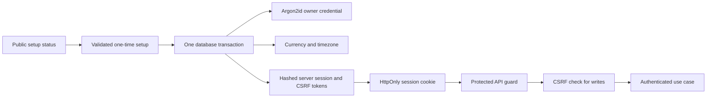
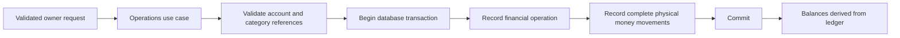
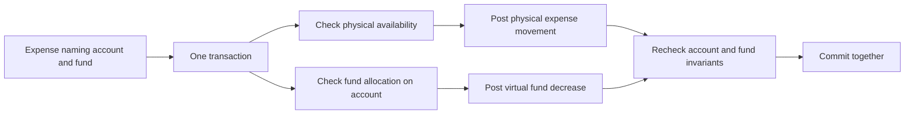
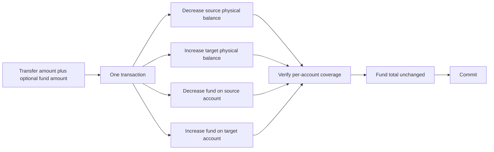
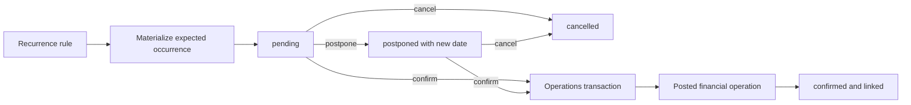
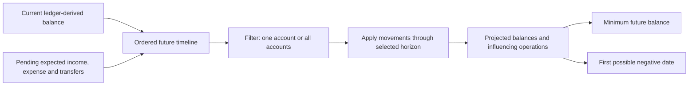

# Data flows

The diagrams describe confirmed semantic flows. Names such as “transaction
boundary” are architectural concepts, not promised endpoint, class or table
names.

## First-run setup and authenticated requests

After credential commit, setup can only report a conflict. Login throttling is
locked and updated in the same database transaction as password verification
and session issuance, preventing parallel attempts from bypassing the counter.
Database request dependencies close at FastAPI function scope, so a successful
HTTP response and authentication cookies are sent only after transaction commit.

## Posting an ordinary operation

Editing or deleting follows the same transaction boundary: replace or remove all
parts of the operation atomically, then derive balances from the resulting
ledger. A balance adjustment is itself an operation, including initial balance.

Since `0.1.0-alpha.3`, affected account identities are locked in deterministic
order and their prospective ledger balances are checked before commit. Transfer
movements net to zero; income and expense cross the boundary of modelled
accounts and therefore do not.

Category mutation and posting share the category-tree advisory lock. A type
change consults the operations-owned history contract and is rejected after the
first reference. Account deletion locks the account before checking movement
history, using the same account-row ordering convention as posting.

An application-layer use case coordinates account identity,
base-currency lock, optional non-zero adjustment and its movement in one
transaction. Neither Accounts nor Operations depends on the other's private
implementation. The initial adjustment date is resolved in the application
timezone.

## Expense from a virtual fund

## Transfer with a virtual fund movement

The alpha.4 fund part cannot exceed the physical transfer amount. Accounts and
then funds are locked in deterministic UUID order; physical and virtual
movements are replaced together before coverage is verified.

## Explicit fund allocation

Virtual redistribution uses the same lock and coverage order but posts equal
opposite fund movements and no account movement.

## Expected occurrence to actual operation

Materialization locks each rule and uses unique `(rule_id, scheduled_on)`
identity for a one-calendar-year window. Generating, postponing or cancelling
an occurrence never changes the actual balance. Confirmation locks the
occurrence, creates one actual operation through the Operations public contract
and records its link in the same transaction. A retry returns that link instead
of posting again. Sliding the window preserves overdue untouched occurrences.
Rule replacement locks the rule and all of its occurrences before validating
the category and deterministically ordered accounts. Confirmation already owns
the occurrence before taking those same reference locks, so concurrent rule
editing and posting serialize without a reverse lock dependency.

## Forecast calculation

Supported horizons are week, month, quarter, half-year and year. Forecasting is
a read calculation and cannot silently post expected data. Beta.2 reads the
Operations ledger and actionable Scheduling occurrences through their public
contracts; liabilities and debts remain future sources until their domains
exist. Events are grouped into deterministic daily closing points. Overdue
occurrences are excluded explicitly and reported, while an internal transfer is
neutral only in the combined scope.
