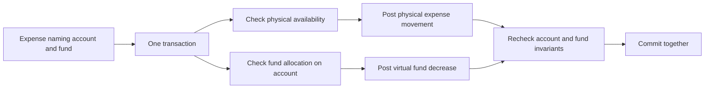
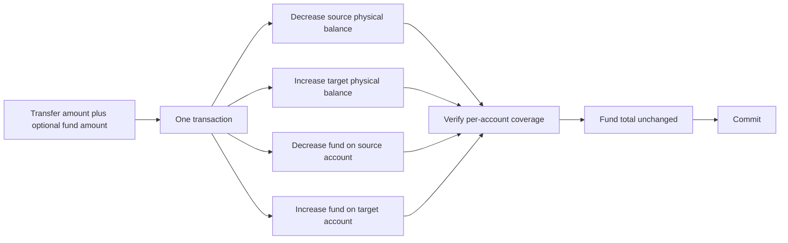
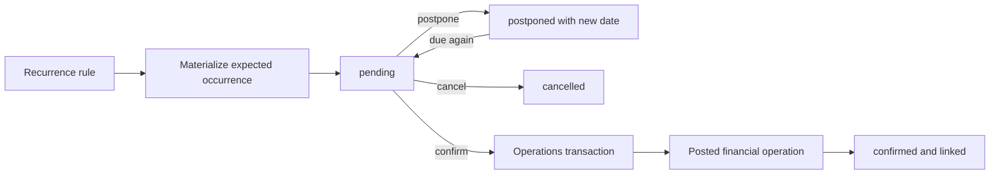
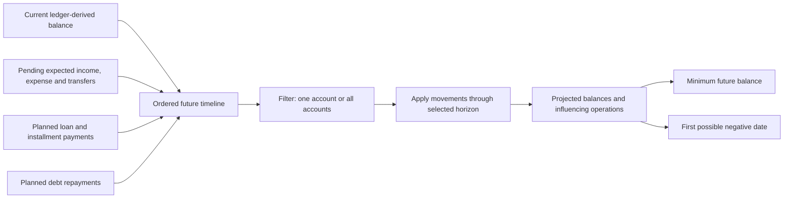

# Data flows

The diagrams describe confirmed semantic flows. Names such as “transaction
boundary” are architectural concepts, not promised endpoint, class or table
names.

## Posting an ordinary operation

Editing or deleting follows the same transaction boundary: replace or remove all
parts of the operation atomically, then derive balances from the resulting
ledger. A balance adjustment is itself an operation, including initial balance.

## Expense from a virtual fund

## Transfer with a virtual fund movement

The fund part cannot exceed the physical transfer amount without an explicitly
designed alternative rule; this is currently an assumption, not an
owner-confirmed invariant.

## Expected occurrence to actual operation

Generating, postponing or cancelling an occurrence never changes the actual
balance. Confirmation creates one actual operation and must be idempotent.
Idempotency is a technical requirement inferred from safe retries and still
needs a concrete design.

## Forecast calculation

Supported horizons are week, month, quarter, half-year and year. Forecasting is
a read calculation and cannot silently post expected data.
