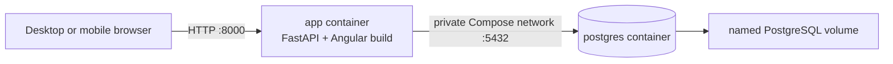
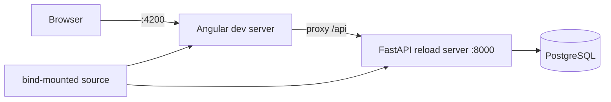

# Deployment architecture

## Production-like Compose

The multi-stage Dockerfile compiles Angular, installs hash-locked Python
dependencies and produces one non-root application image. At startup the app
runs `alembic upgrade head` before Uvicorn. Only the app port is published;
PostgreSQL has no host port.

Compose health checks PostgreSQL with `pg_isready` and the application through
`GET /api/v1/health`. The current HTTP endpoint reports process readiness; the
dependency order and PostgreSQL health check cover startup database readiness.

## Development Compose

Development publishes frontend and backend on loopback, bind-mounts source and
uses separate named volumes for PostgreSQL and frontend dependencies.

## Security boundary

The deployment assumes a trusted network. For remote access, put the single app
entrypoint behind a VPN or HTTPS reverse proxy. Never publish PostgreSQL merely
for convenience; use an explicit local override and loopback binding if an
administrator genuinely needs host database access.

## Open questions

- Supported reverse proxies and forwarded-header configuration.
- Container image publishing, signing and supported CPU architectures.
- Migration failure recovery before the first public schema release.
- Whether health should later expose separate liveness and database-readiness
  endpoints without leaking operational detail.
