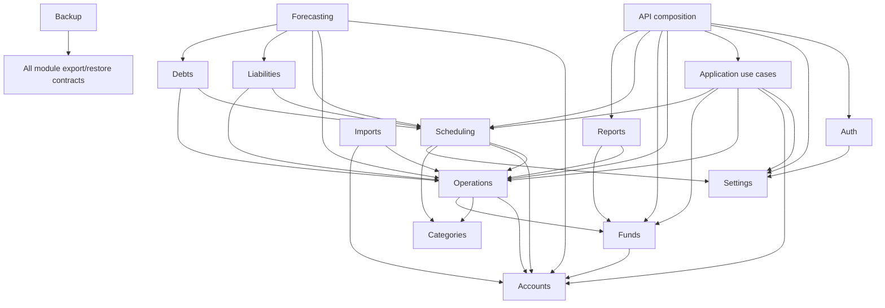

# Module boundaries

## Ownership map

| Module | Owns | Collaborates through |
| --- | --- | --- |
| `auth` | owner setup, password hash, sessions, login throttle | authentication dependency and settings setup contract |
| `settings` | persisted preferences and base-currency lock | explicit settings queries/commands |
| `accounts` | account identity and account rules | account references and balance read contract |
| `categories` | category tree | category reference validation |
| `operations` | posted operations and physical money movements | atomic posting commands and ledger reads |
| `funds` | fund definitions, percentages, virtual movements | fund posting contracts and application coordination with physical ledger reads |
| `scheduling` | recurrence rules and expected occurrences | confirmation command into operations |
| `forecasting` | future-balance calculations | read contracts from ledger and plans |
| `liabilities` | credits and installment plans | planned/payment integration contracts |
| `debts` | `i_owe` and `owed_to_me` obligations | repayment posting contract |
| `reports` | reporting read models | public read contracts only |
| `imports` | parse, map, preview, duplicate candidates | owning modules' validation/write commands |
| `backup` | versioned export and restore orchestration | module-owned export/import contracts |

`app.core` owns technical configuration and database lifecycle, not business
rules. `app.api` composes HTTP routes and cross-cutting concerns. Cross-module
commands that share a transaction belong to `app.application`; it owns no tables
and calls only public module contracts.

## Dependency direction

Arrows below mean “uses a public contract of”, not direct access to private
tables.

Authentication guards every API except setup, login and health. It does not own
financial data. Backup may orchestrate all modules, but must not duplicate their
validation rules.

Scheduling validates account/category snapshots and the application timezone
through those modules' public contracts. It posts confirmed occurrences only
through the Operations contract and never writes the physical ledger directly.

The auth setup use case calls the settings module's public initialization
command with the same SQLAlchemy session so credential, preferences and first
session commit atomically. A future module creating the first financial record
must call settings' public currency-lock command in that write transaction.
These Python-level commands and validators are exported by
`app.modules.settings.contracts`; HTTP authentication and CSRF dependencies are
composed by `app.api`, so the settings module does not depend on auth internals.

## Boundary rules

- A module owns writes to its state and defines any public commands or reads.
- Cross-module changes that must stay consistent share one database transaction.
- Cross-module orchestration normally belongs to `app.application`. A module
  that owns a source record's lifecycle may call another module's explicit
  public posting contract when the dependency remains one-way; operation-owned
  fund movements use this narrower rule.
- Read-oriented modules may query purpose-built public read models; this does not
  authorize writes around the owner module.
- Avoid generic repository or service abstractions until repeated behaviour
  proves a real need.
- Moving code between modules requires updating this map and related domain docs.

## Open questions

- Whether liabilities and debts remain separate modules once detailed lifecycle
  use cases are designed.
- Which stable public read contracts reporting and forecasting need.
