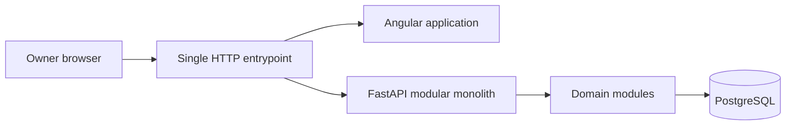

# Architecture overview

## Owner-confirmed direction

Hermes is a single-owner, self-hosted adaptive web application. Its architectural
style is a **modular monolith**: one deployable application and one PostgreSQL
database, with explicit domain ownership inside the codebase. It has no
microservices, broker, background job system, Redis, Kubernetes or plugin
platform.

The production Angular build and `/api` share one HTTP entrypoint. Development
may use a separate Angular dev server. Data must not depend on external cloud
services.

## Initialization decisions

- FastAPI uses an application factory and lifespan hook.
- A SQLAlchemy engine and session factory are application-scoped; the engine is
  disposed during shutdown.
- Alembic is configured against shared metadata, but no empty revision exists.
- Runtime configuration uses `HERMES_*` environment variables. Database
  credentials are assembled into a SQLAlchemy PostgreSQL URL without logging the
  password.
- Health is exposed at `GET /api/v1/health`; it proves process readiness, not
  database liveness. Compose separately health-checks PostgreSQL.
- Angular 22 uses standalone, lazy-routed pages, strict TypeScript, a development
  proxy and no third-party UI component library.
- Angular CLI's persistent LMDB build cache is disabled after a reproducible
  native crash on the initialization macOS/Node combination. Clean local and
  container builds remain deterministic without it.
- Temporary npm overrides keep Angular CLI's transitive MCP/Hono development
  tooling on compatible patched versions; remove them once Angular CLI includes
  those versions directly.

## Layering principle

Application-wide `api` and `core` packages compose HTTP and runtime
infrastructure. Business state and rules belong to modules. Modules collaborate
through public contracts and transactional use cases, never through another
module's private tables or implementation objects.

## Explicit assumptions

- The project name is **Hermes**, inferred from the repository directory.
- Python 3.13 and PostgreSQL 17 are the initial supported runtime versions.
- The first deployment can run synchronous SQLAlchemy request work. Re-evaluate
  only with measurements; async database access is not an architectural goal.

## Open questions

- Which currency model is required: one base currency, per-account currencies,
  or conversion-aware reporting?
- Which session persistence and cleanup policy should authentication use?
- What concurrency policy protects ledger and fund invariants under simultaneous
  requests?
- What compatibility window will backup restore support across app versions?
