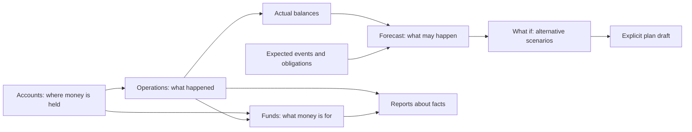

# Information architecture

## Status and constraints

The currently implemented `0.4.0` structure was approved by the owner on
2026-08-18 as the baseline for the first public release. It does not change
module ownership or approve roadmap capabilities that have not yet been
designed. Alternatives below remain directions for future validation rather
than release blockers.

The primary IA rule is that navigation follows user questions while data
relationships follow confirmed domain boundaries.

## Sections

### Overview

The starting command center: free money as the primary answer, total balance,
debts and liabilities after implementation, trends, upcoming events, forecast
risk, compact analytics, and fast operation creation. It does not replace
detailed sections.

### Operations

One journal of actual income, expense, transfer, and adjustment operations. It
contains search, filters, details, editing, and deletion. Expected events do not
mix with the actual journal without an explicit mode.

### Accounts

The physical location of money: cash, debit, and savings accounts, their
ledger-derived balances, free and reserved portions, account-specific history,
and lifecycle.

### Funds

The purpose assigned to real money: fund amounts and optional targets, exact
progress, allocation percentage, account breakdown, virtual-movement history,
direct initial reservation, and transfers between funds. A fund is not
presented as a bank account.

### Plan

One future-oriented area with internal views:

- **Upcoming** — expected events and obligations requiring attention;
- **Calendar** — expected events arranged in time;
- **Forecast** — future balances and risks;
- **Oracle · What if?** — temporary comparison of alternative financial
  scenarios without changing facts or the confirmed plan.

Grouping these views reduces duplicate navigation but does not mix Scheduling
and Forecasting domain ownership.

### Reports

Answers about the past: category expenses, income and expenses over a period,
and account and fund trends. Every aggregate drills down to a filtered journal.

### Settings

Base currency and timezone, security and sessions, category management,
archived entities, import and export, backup and restore, and instance status.
Categories are an important directory but not a daily top-level workflow.

Until a capability exists, its section may be absent or clearly marked
unavailable. Do not create convincing empty dashboards for an unimplemented
domain.

## Global navigation

### Desktop

The sidebar is visible by default, but the owner can hide it with a shell
button. That choice persists locally, and a visible restore action remains:

1. Overview.
2. Accounts.
3. Operations.
4. Funds.
5. Plan with Calendar and Forecast views.
6. Reports with an Income and expenses view.

Categories and Settings belong to a secondary Management group. Local-instance
status and logout appear in the navigation footer. The current interface has no
Help section. Labels remain visible beside icons; icon-only navigation is not
the baseline.

### Narrow screen

The current implementation uses a compact multi-row header and preserves every
available section without hidden horizontal scrolling. A bottom navigation bar
with four frequent sections remains only a hypothesis for comparison. Real
observation must determine which sections are frequent.

### Section context

The page header contains the title, shared period or scope, and at most one
primary contextual action. The owner-confirmed rule is creation of the key
entity on a list or section and editing on a specific entity page. Breadcrumbs
appear only for real nesting, such as `Accounts → Cash`, and do not repeat the
sidebar on every top-level page.

## Global quick actions

- A permanently available “New operation” action.
- The future “What if?” decision action from dashboard and forecast; it never
  replaces creation of an actual operation.
- Contextual actions such as “Add account”, “Allocate money”, and “Add expected
  event”.
- A keyboard entry point for operation creation after shortcut conflicts are
  evaluated.
- A future command palette for navigation and actions, but never as the only
  discoverable route.

A quick action preserves its origin: creation from an account preselects that
account, and creation from a fund may preselect that fund. Every default remains
visible and editable.

Creating and editing accounts, categories, funds, operations, and recurrence
rules opens in a temporary modal layer instead of occupying a permanent list
column. `Esc` and an explicit close action return to the originating context.

Account and category selection in financial forms uses one searchable
combobox. An empty field shows up to five genuinely recent selections; typing
filters by name prefix, and a secondary line distinguishes identically named
subcategories and shows financial context. A regular `select` remains suitable
for short closed lists such as operation type or period. Technical directories
with compound identifiers may explicitly support substring search: Settings
uses this for IANA timezones so `Moscow` finds `Europe/Moscow`; financial
directories remain prefix-based.

## Dashboard as a decision layer

Dashboard information follows the order of user questions:

1. **Now:** free money first, then physical total and money in funds.
2. **Needs attention:** shortfall, overdue event, allocation conflict, or another
   exception.
3. **Next:** upcoming obligations and a short forecast.
4. **What if:** enter a hypothetical financial decision.
5. **What changed:** recent operations and material period changes.
6. **Why:** compact trends and expense analysis with journal drill-down.

A shared period applies to related blocks, but it must not make the meaning of
“Now” ambiguous.

## Entity relationships in the interface

### Account ↔ operation

A balance is derived from movements, so selecting it opens that account's
journal. Direct balance editing is replaced by an explicit adjustment.

### Operation ↔ category

A category classifies income or expense. Selecting an analytics category can
open filtered operations. An archived category remains visible in history but
is unavailable for a new operation.

### Account ↔ fund

An account shows physical balance and its virtual coverage. A fund shows its
total and physical account breakdown. Both sides lead to the same explainable
set of virtual movements.

### Operation ↔ fund

An expense from a fund reduces physical and virtual money atomically. A
transfer may move its virtual portion with the physical money. Details show
both effects within one operation rather than as unrelated records.

### Expected event ↔ actual operation

Confirmation creates an actual operation and preserves the link. Postponement
and cancellation do not change the current balance. An expected event never
looks like an already posted journal row.

### Forecast ↔ scenario ↔ plan

The forecast is the baseline of known facts and plans. “What if?” applies a
temporary hypothesis to the same snapshot and shows the delta without changing
the baseline. A saved scenario remains hypothetical. A separate action may
move its reviewed fields into a plan-draft composer; normal composer
confirmation remains the only write path.

### Fact and plan ↔ forecast

The forecast starts from a ledger-derived balance and applies future events in
time order. Every point reveals its starting balance and influencing events.

## Shared presentation models

- **Scope:** all compatible accounts or one account.
- **Period:** stable presets plus a custom range where needed.
- **Filter:** visible chips for active conditions; reset returns to an
  understandable default.
- **Details:** a side panel for quick inspection without losing the list; a
  separate page for complex editing or a deep workflow.
- **Drill-down:** chart or total → filtered selection → operation details.
- **Empty state:** explains the entity and one safe next action.

## What does not belong in primary navigation yet

- separate Income and Expense sections: they are types of one operation;
- a top-level Categories section: it is a supporting directory;
- cards, payments, investments, and invoices borrowed from visual references:
  they are outside the confirmed scope;
- an administrative dashboard as the home page;
- AI insights or a financial score without a separate product decision;
- configurable dashboards before the fixed structure is validated.

## Possible improvements after the first release

- Should Plan combine calendar and forecast, or does Forecast deserve a
  top-level destination?
- Should shared search cover only operations or also accounts, funds, and
  settings?
- Does category management belong in Settings or a secondary section?
- Which four destinations genuinely deserve mobile bottom navigation?
- Is a side panel sufficient for operation details on desktop, and what is the
  correct mobile transition?
