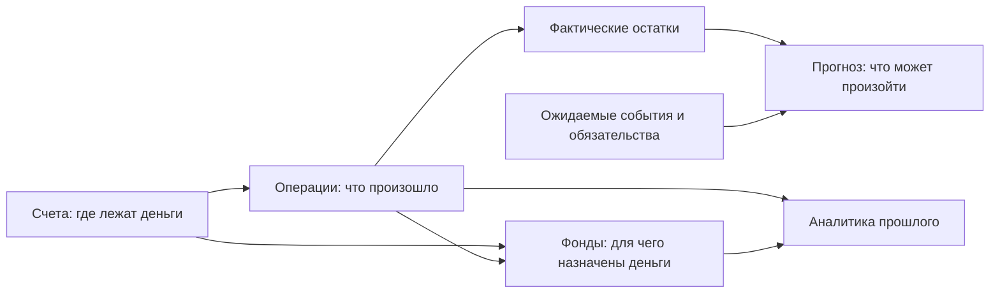

# Information architecture

## Статус и ограничения

Это предлагаемая структура, которую нужно проверить wireframe и реальными
сценариями. Она не меняет ownership модулей и не утверждает ещё не
спроектированные возможности roadmap.

Основной принцип IA: навигация следует вопросам пользователя, а связи данных —
подтверждённым доменным границам.

## Предлагаемые разделы

### Обзор

Стартовый обзорный командный центр: свободные деньги как primary, общий остаток,
долги/обязательства после их реализации, тренды, ближайшие события, прогнозный
риск, компактная аналитика и быстрое создание операции. Не заменяет детальные
разделы.

### Операции

Единый журнал фактических доходов, расходов, переводов и корректировок. Здесь
находятся поиск, фильтры, детали, редактирование и удаление. Ожидаемые события не
смешиваются с фактическим журналом без явного режима.

### Счета

Физическое местонахождение денег: наличные, дебетовые и накопительные счета,
их ledger-derived остатки, свободная и зарезервированная части, история
конкретного счёта и lifecycle.

### Фонды

Назначение реальных денег: суммы фондов, процент распределения, разбивка по
счетам, история виртуальных движений и действия распределения. Фонд не
представляется как банковский счёт.

### План

Одна предметная область будущего с внутренними представлениями:

- **Ближайшее** — список ожидаемых событий и требующих внимания обязательств;
- **Календарь** — временное расположение ожидаемых событий;
- **Прогноз** — расчёт будущих остатков и рисков.

Объединение уменьшает дублирование навигации, но не смешивает scheduling и
forecasting на уровне доменного ownership.

### Аналитика

Ответы о прошлом: расходы по категориям, доходы и расходы за период, динамика
остатков и фондов. Любой агрегат раскрывается в отфильтрованный журнал.

### Настройки

Основная валюта и timezone, безопасность и сессии, управление категориями,
архивные сущности, импорт/экспорт, backup/restore и состояние экземпляра.
Категории — важный справочник, но не ежедневный top-level сценарий.

До появления части функций разделы могут отсутствовать или быть явно помечены
как недоступные; нельзя создавать правдоподобные пустые dashboards для
нереализованного домена.

## Глобальная навигация

### Desktop

Предварительная модель — постоянная боковая навигация:

1. Обзор.
2. Операции.
3. Счета.
4. Фонды.
5. План с представлениями «Календарь» и «Прогноз».
6. Аналитика.

Настройки, help и состояние экземпляра отделены в нижнюю служебную группу.
Названия видимы вместе с иконками; icon-only режим не является базовым.

### Узкий экран

Нельзя механически переносить все пункты в нижнюю панель. В нижней навигации
остаются наиболее частые разделы, остальные доступны через «Ещё» или menu.
Какие именно разделы самые частые, нужно подтвердить наблюдением; вероятные
кандидаты — Обзор, Операции, Счета и План.

### Контекст раздела

В заголовке страницы находятся название, общий период/scope и одно основное
действие. Owner-confirmed правило: на списке/в разделе это создание ключевой
сущности, а на странице конкретной сущности — её редактирование. Breadcrumb
нужен только при реальной вложенности, например `Счета → Наличные`, но не
повторяет боковую навигацию на каждом top-level экране.

## Глобальные быстрые действия

- Постоянно доступное действие «Новая операция».
- Контекстные варианты: «Добавить счёт», «Распределить деньги», «Добавить
  ожидаемое событие».
- Вызов создания операции с клавиатуры после проверки конфликтов shortcuts.
- В перспективе — command palette для навигации и действий, но не как
  единственный способ обнаружить функцию.

Quick action сохраняет происхождение: создание из конкретного счёта подставляет
счёт; создание из фонда может подставить фонд. Любой default остаётся видимым и
изменяемым.

## Dashboard как слой решений

Порядок информации на dashboard отвечает последовательности вопросов:

1. **Сейчас:** свободные деньги как primary, затем физический итог и сумма в
   фондах.
2. **Требует внимания:** дефицит, просроченное событие, нарушение/невозможность
   распределения или другие исключения.
3. **Дальше:** ближайшие обязательства и короткий прогноз.
4. **Что изменилось:** последние операции и существенные изменения периода.
5. **Почему:** компактные тренды и анализ расходов с переходом к журналу.

Общий период действует на связанные блоки, но значение «сейчас» не должно
становиться двусмысленным из-за фильтра исторического периода.

## Связи сущностей в интерфейсе

### Счёт ↔ операция

Остаток выводится из движений, поэтому клик по остатку ведёт к журналу этого
счёта. Редактирование баланса заменяется явной корректировкой.

### Операция ↔ категория

Категория классифицирует доход/расход. Из категории в аналитике можно перейти к
отфильтрованным операциям. Архивная категория остаётся видимой в истории, но не
предлагается для новой операции.

### Счёт ↔ фонд

Счёт показывает физический остаток и его виртуальное покрытие. Фонд показывает
общую сумму и физическую разбивку по счетам. Обе стороны ведут к одному и тому
же объяснимому набору виртуальных движений.

### Операция ↔ фонд

Расход из фонда уменьшает физическую и виртуальную части атомарно. Перевод может
переместить виртуальную часть вместе с физической. Экран деталей показывает оба
эффекта в одной операции, а не две несвязанные записи.

### Ожидаемое событие ↔ фактическая операция

Подтверждение создаёт фактическую операцию и сохраняет связь. Перенос и отмена
не меняют текущий баланс. В UI ожидаемое событие не выглядит как уже проведённая
строка журнала.

### Факт и план ↔ прогноз

Прогноз начинается с ledger-derived остатка и применяет будущие события по
времени. Каждая точка раскрывает свой starting balance и влияющие события.

## Общие модели представления

- **Scope:** все совместимые счета или один счёт.
- **Period:** устойчивые presets плюс произвольный диапазон там, где он нужен.
- **Filter:** видимые chips для активных условий; сброс возвращает понятный
  default.
- **Details:** side panel для быстрого изучения без потери списка; отдельный
  экран для сложного редактирования или глубокого сценария.
- **Drill-down:** график/итог → отфильтрованная выборка → деталь операции.
- **Empty state:** объясняет сущность и одно безопасное следующее действие.

## Что не следует помещать в основную навигацию сейчас

- отдельные пункты для доходов и расходов: это типы одной операции;
- отдельный раздел категорий: это поддерживающий справочник;
- карточки, платежи, инвестиции и invoices из визуальных референсов: они не
  соответствуют подтверждённому scope;
- административный dashboard как главный экран;
- AI-insights и «финансовый рейтинг» без отдельного продуктового решения;
- настраиваемые dashboards до проверки фиксированной структуры.

## Вопросы для IA-прототипа

- Должен ли раздел «План» объединять календарь и прогноз или прогноз заслуживает
  отдельного top-level пункта?
- Нужен ли общий поиск только по операциям или глобально по счетам, фондам и
  настройкам?
- Является ли управление категориями частью настроек или отдельным вторичным
  разделом?
- Какие четыре направления действительно заслуживают места в mobile bottom
  navigation?
- Достаточно ли side panel для деталей операции на desktop и каким должен быть
  mobile-переход?
